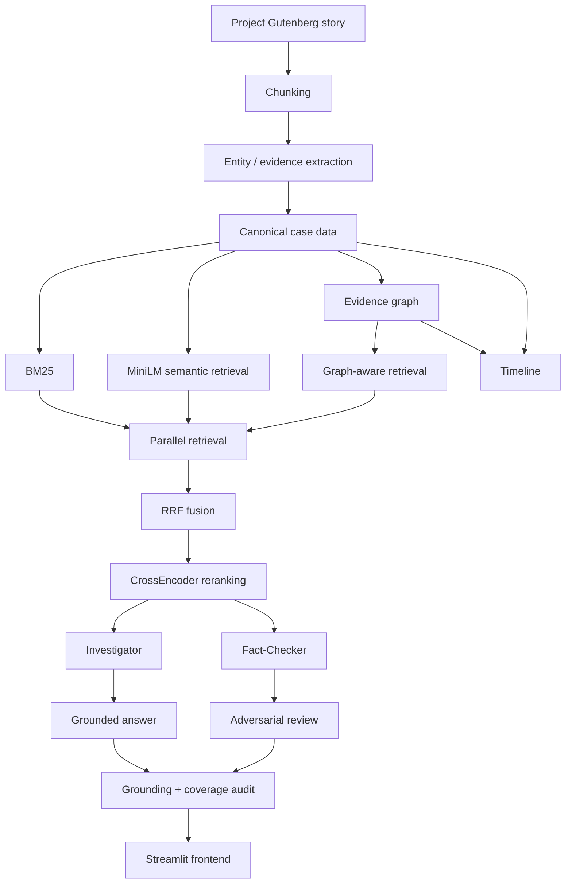

# CaseFile AI

CaseFile AI is an interactive investigation app I built for the 180DC ML recruitment task.

The idea was to make a RAG system where the model does not just retrieve documents and answer once. Instead, the user can actually investigate a case, search evidence, question people, inspect relationships, make a prediction, and then compare it with an Investigator agent and a separate Fact-Checker.

The case I used is **The Adventure of the Norwood Builder** by Arthur Conan Doyle, using the public-domain Project Gutenberg text.

One thing I wanted to be careful about throughout the project was this:

> A document saying something happened does not automatically mean that thing is true.

So evidence is stored as verified, unverified, disputed, or misleading, instead of treating every extracted statement as a fact.

---

## What you can do in the app

The app lets you:

- search through the evidence
- interrogate people in the case
- inspect a visual evidence graph
- look through an investigation timeline
- make your own initial prediction
- run the Investigator agent
- see the Fact-Checker challenge the Investigator
- inspect the agent execution trace
- check citation grounding and evidence coverage
- submit a final verdict with evidence

---

## Architecture



---

## Dataset / corpus

I used the Project Gutenberg version of **The Adventure of the Norwood Builder**.

The story is split into source-preserving chunks and every chunk gets a stable `DOC_###` ID.

The current processed case has:

- 16 documents
- 30 canonical entities
- 87 evidence items
- 26 relationships
- 10 timeline events

Evidence split:

- 20 verified
- 67 unverified

I also validate extracted source excerpts against the original text so the extraction step cannot freely invent evidence.

---

## Evidence extraction

Each evidence item stores things like:

- evidence ID
- document ID
- claim
- source excerpt
- evidence type
- status
- source speaker
- linked entities
- support / contradiction labels

I use four evidence states:

- `verified` — directly established evidence
- `unverified` — testimony, theory, allegation, suspect statement, etc.
- `disputed` — explicitly conflicting evidence
- `misleading` — evidence later shown to be staged / deceptive

This ended up being pretty important because the story contains a lot of statements which sound factual but are actually only someone's version of events.

---

## Retrieval

The retrieval system uses multiple methods.

### BM25

Useful when the query contains exact names, objects, or phrases.

### Semantic retrieval

I use:

```text
sentence-transformers/all-MiniLM-L6-v2
```

This helps when the wording in the query is different from the wording in the story.

### Graph-aware retrieval

The evidence graph can also contribute candidates for queries involving relationships between entities.

I do not use this blindly for every query because graph retrieval actually made some rankings worse during testing.

### RRF

The candidate lists are combined using Reciprocal Rank Fusion.

### CrossEncoder reranking

Final candidates are reranked using:

```text
cross-encoder/ms-marco-MiniLM-L-6-v2
```

This gave the best final ranking in my small regression benchmark.

---

## Parallel retrieval

BM25, semantic retrieval, and graph-aware retrieval run in parallel.

I added a regression test where each retrieval arm was artificially delayed by `0.30 s`.

Sequentially that should take around:

```text
0.90 s
```

The parallel version completed in around:

```text
0.305 s
```

---

## Investigator agent

The Investigator does not just answer once.

Roughly, the flow is:

1. form a theory
2. retrieve evidence
3. decide whether the evidence is enough
4. identify missing information
5. reformulate and search again
6. stop after a bounded number of retries
7. run a wider coverage check if needed
8. produce a final cited answer

I also added a verified-evidence safety pass after finding a real failure case during testing.

Originally, the Investigator gave a fully grounded answer but still missed a decisive verified piece of evidence. That made it clear that:

> grounding is not the same thing as completeness

So the final coverage stage checks all verified evidence before the answer is finalized.

---

## Fact-Checker agent

The Fact-Checker runs separately from the Investigator.

It deliberately looks for:

- contradictions
- alternative explanations
- conflicting timeline evidence
- weaknesses in the Investigator's theory
- evidence pointing toward another interpretation

I wanted this to behave like an actual adversarial second agent instead of just rephrasing the first answer.

---

## Evidence graph

The evidence graph is built using `NetworkX MultiDiGraph`.

Current graph size:

```text
152 nodes
470 edges
```

Node types include:

- entities
- evidence
- documents
- hypotheses
- events
- time nodes

Some of the graph edges are:

```text
mentioned_in
extracted_from
about_entity
supports
contradicts
extracted_relationship
supports_event
context_for_event
participates_in
occurs_at_place
occurs_at_time
investigation_before
```

There are currently **0 isolated canonical entities**.

---

## Timeline

I added a structured investigation timeline because the assignment explicitly mentioned events and timestamps.

The timeline keeps apart:

- the order in which something enters the investigation
- the relative time mentioned in the story
- observed vs recounted events
- core evidence vs context evidence

This matters because a character can recount something that supposedly happened earlier even though that statement appears much later in the investigation.

---

## Retrieval testing

I made a small manually written set of six queries to check whether retrieval changes break important case evidence.

This is only a **regression / sanity benchmark**, not a serious evaluation dataset.

| Retriever | Hit@1 | Hit@3 | Hit@5 | MRR@5 |
|---|---:|---:|---:|---:|
| BM25 | 50.0% | 100.0% | 100.0% | 69.4% |
| MiniLM semantic | 83.3% | 83.3% | 83.3% | 83.3% |
| Hybrid RRF | 66.7% | 100.0% | 100.0% | 83.3% |
| Graph-aware RRF | 66.7% | 100.0% | 100.0% | 80.6% |
| **Production + CrossEncoder** | **100.0%** | **100.0%** | **100.0%** | **100.0%** |

One interesting result was that graph-aware retrieval did **not** automatically improve ranking. The graph signal helped some relational queries but hurt others, so I ended up using it conditionally and letting the CrossEncoder handle the final ranking.

---

## Answer quality checks

The app checks two different things after the agents finish.

### Citation grounding

Are the claims actually supported by the evidence IDs being cited?

### Coverage

Did the answer miss an important piece of evidence that could change the conclusion?

I keep these separate because a response can be perfectly grounded and still incomplete.

---

## Frontend

The frontend is built in Streamlit.

The main tabs are:

- Evidence
- Interrogation
- Graph
- Timeline
- Investigator
- Verdict

I styled it more like a case file / investigation board rather than a normal chatbot dashboard.

---

## Tech stack

### Backend

- FastAPI
- Pydantic
- Google Gemini
- NetworkX

### Retrieval / ML

- `rank-bm25`
- `sentence-transformers`
- `all-MiniLM-L6-v2`
- `cross-encoder/ms-marco-MiniLM-L-6-v2`
- NumPy
- RRF

### Frontend

- Streamlit
- Graphviz

---

## Running locally

Create the environment:

```bash
python3.11 -m venv .venv
source .venv/bin/activate
```

Install packages:

```bash
pip install -r requirements.txt
```

Create a `.env` file:

```env
GEMINI_API_KEY=your_key_here
GEMINI_MODEL=gemini-3.5-flash-lite
```

Start the backend:

```bash
python -m uvicorn backend.main:app --reload
```

Start the frontend in another terminal:

```bash
source .venv/bin/activate
python -m streamlit run frontend/app.py
```

---

## Useful tests

```bash
python -m scripts.test_coverage_guard
python -m scripts.test_parallel_retrieval
python -m scripts.test_timeline_graph
python -m scripts.evaluate_retrieval
```

Current results:

```text
Coverage guard regression test: PASS
Parallel retrieval regression test: PASS
Timeline + graph regression test: PASS
```

---

## Extra features from the task brief

Implemented:

- CrossEncoder reranking
- graph-aware retrieval
- contradiction detection
- temporal reasoning
- parallel retrieval
- agent execution traces
- automatic grounding checks
- automatic coverage checks
- visual evidence graph

Not implemented:

- multiple cases
- persistent cross-session memory

I decided not to add those two because I would rather keep one case working properly than add more scope just for the feature count.

---

## Limitations

A few things I would improve with more time:

- the retrieval benchmark is very small
- the system currently supports only one case
- the timeline mostly uses relative time instead of exact timestamps
- graph retrieval is useful only for some query types
- some evidence stays deliberately unverified because that is how the source presents it
- agent reasoning still depends on Gemini, so LLM failure is still possible

---

## Current status

The ML / RAG side is feature-complete for the recruitment task.

Completed:

- public deployment
- technical report
- retrieval / coverage regression testing
- Live app
- Demo video


Live app: https://agentic-rag-investigation-lrvtys9izujk3m38nytqtu.streamlit.app

Demo video: (https://github.com/cybermax3007/agentic-rag-investigation/tree/main/demo)
